# 关于Unity的资源管理与加载

[wiki新人培训资源管理](http://wiki.info/x/7gif)

[Warl-G 资源管理概览](https://warl.top/posts/Unity-Resource-Manage/)

[Unity 资源管理总览](http://tonytang1990.github.io/2016/10/13/Unity%E8%B5%84%E6%BA%90/#Resources)

## 0.关于资源文件

纹理、模型、Shader、脚本

编译时应用 or 运行时应用

静态加载 or 动态加载

跟随安装包本地部署 or 服务器部署

<br/>

---

## 1.资源目录

参见 

[资源管理系统-基础篇（一）浅谈Asset](https://zhuanlan.zhihu.com/p/96709802)

[Unity官方资源目录](https://docs.unity3d.com/cn/current/Manual/SpecialFolders.html)


拷贝工程时，理论上只需拷贝根目录下 【Assert】 + 【Package】 + 【ProjectSettings】

<br/>


### 【Assert】

Unity根目录中，一个项目只有一个

所有资源文件，包括纹理、模型、Shader、脚本，都应存放在这个资源目录下

<br/>

### 【Library】

Unity根目录中，一个项目只有一个

当我们切换开发平台的时候，Unity会针对不同的平台，进行一次资源的全部转换处理，外部导入新资源时也会转换处理

转换处理完成的文件保存于【Library】中


<br/>

### 【Package】

Unity根目录中，一个项目只有一个

2018后新增的，能够从Unity工程中分离出来的，具有泛用性的 System/库

Unity自动生成的C#project是不能直接对【Package】进行管理和修改的

同时，Unity的引擎在工作目录里也是没法对它进行操作的，是一个只读的目录

Window中的 Package Manager 引入的外部资源包就被存放在 Package 中 

<br/>

### 【Plugins】

[参见](https://zhuanlan.zhihu.com/p/395616861)

通常只在 【Assert/Plugins】 放置一个

放置第三方包/插件/平台相关的代码库/工具代码/SDK

该目录下的文件会在 standard compiler 时最先编译

Plugins/x86：win32位平台plugin

Plugins/x86_64：win64位平台plugin

Plugins/Android：Android平台

Plugins/iOS：iOS平台


<br/>


### 【Resource】

通常只在 【Assert/Resources】 放置一个

重要的，**需要保证打包进发布工程的资源（打包并加密）**，能够被 Resources.Load() 加载

加载时路径字符串，目录位置默认在 Resources 目录之下 

Resource/a.prefab  ==> Resources.Load("a.prefab");

注意子目录的路径

Resource/A/B/c.prebab ==> Resources.Load("A/B/c.prefab");

<br/>

### 【ProjectSettings】

Unity根目录中，一个项目只有一个

Editor --> ProjectSettings 针对这个Unity工程的配置信息，被存放于【ProjectSettings】中


<br/>

### 【Editor】

工程中可放置多个Editor，但通常只在 【Assert/Editor】 放置一个

各种拓展编辑器的脚本会被放置在Editor中，**保证不打包进发布工程里**，项目中也无法使用这些资源

<br/>

### 【Editor Default Resources】

通常只在 【Assert/Editor Default Resources】放置一个

用于美化拓展编辑器的各种图标文件，**保证不打包进发布工程里**，项目中也无法使用这些资源

<br/>

### 【StreamingAssets】

[参见](https://blog.csdn.net/weixin_41798071/article/details/100141901)

流资源，通常只在 【Assert/StreamingAssets】 放置一个

【StreamingAssets】也**保证会打包进发布工程，但不会加密处理，也不会在跨平台时被格式转换**

因此一些需要访问原版的，不希望被压缩的流文件，例如字符串流/音频流，可以放置在【StreamingAssets】中
 
<br/>

### 【被忽略的】

临时的，个人测试用的，保证不打包进工程的

以.开头

以~结尾

名为 cvs 

以.tmp结尾

<br/>

---

## 2.资源导入与管理

外部拖入，或者内部 Assert 目录下右键Create创建

**但后续的删改，必须在Unity编辑器中完成**

**外部导入，注意文件的后缀名，影响Unity在导入时如何解码转换**


<br/>

### 2.1 meta文件

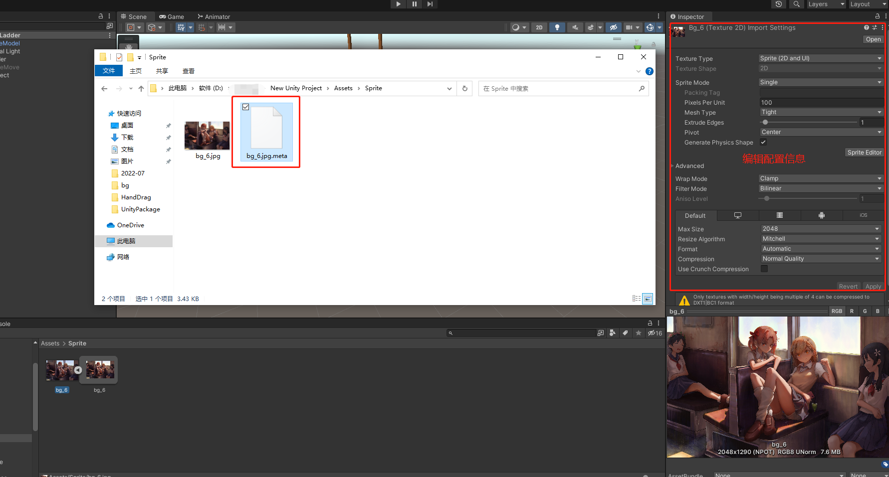

Unity针对每一种资源都有专门的配置信息，可在Inspector中编辑

例如图片的各种属性，平台相关，Prefab内部Component可序列化的配置内容

**配置信息记录于同目录下与资源同名的 .meta 文件中**


<br/>

### 2.2 meta与GUID

[参见-unity中的.meta文件](https://blog.csdn.net/weixin_43149049/article/details/123666992)

[参见-Unity GUID](https://blog.csdn.net/weixin_42186870/article/details/115102916)


导入时Unity会为每一个资源分配一个 GUID 用于全局表示对该资源的引用

资源与资源之间的引用关系（prefab引用了某个png纹理），通过GUID记录

GUID避免了后续我们移动资源目录位置、重命名资源时，对于之前引用的修改

但我们也必须清楚 **GUID 会被写入进 meta 中，因此后续删改移动必须在Unity编辑器中完成，保证资源与meta文件能够对应**

**通过 svn/git 导入替换修改资源时，与资源对应的meta文件也要同步上传**


<br/>

### 2.3 LocalID

复合资源内部，各个Component组件，子层级之间的引用关系，通过 LocalID 来记录

LocalID不完全等于FileID ？


<br/>

### 2.4 InstanceID

通过 GUDI + LocalID，计算得到

InstanceID完全由数字组成，位数较短，保存了其与 GUID 和 LocalID 的映射关系

能在全局完成快速查找获取的一种自增ID

UnityEngine.Object 有一个GetInstanceID的接口

<br/>

---

## 3.资源的静态引用

场景之中已经创建好的对象，他们所引用的资源文件（UI的纹理、模型的贴图 Shader），Inspector 里序列化引用的资源，会在游戏创建时被静态加载

prefab被加载时，prefab引用到的资源会被静态加载


<br/>

---

## 4.资源的动态加载与管理

先要分清，AB包资源，Asset资源/对象，实例对象 三个概念

一些PreSet配置，或是文本流无需实例化，直接应用 Asset 资源/对象 即可

而Prefab，往往需要通过实例化/克隆，添加应用到场景中

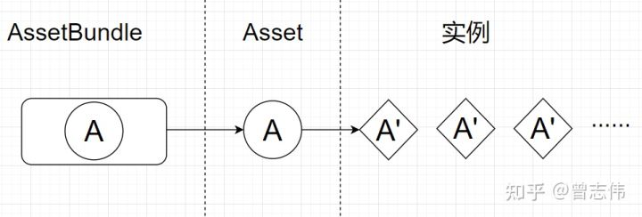

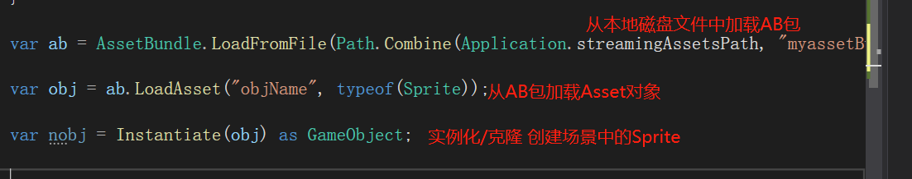

AB包加载会生成对应的AB包资源文件（AB对象），需要通过 ab包实例的 .Unload 自我卸载，如果传参true会一并卸载来从这个ab包加载的 Asset 对象，默认false 只卸载ab包资源不影响从这个ab包加载的Asset资源

任何XXXLoad，都是往内存中加载对象（Asset对象），加载出来的Asset对象需要一定的 UnLoad 机制才能销毁清理掉(Resources.UnloadAsset / Resources.UnloadUnusedAssets)

而基于Load加载对象进行的Instantiate实例化/Clone（实例对象），如果是GameObject Prefab 会添加到场景中，需要通过 Destory(obj) 销毁清理

特别注意 Destory 也能作用于Asset对象，但如果这个 Assert 是由Load加载的（不是复制体），会一并清理掉磁盘中的资源文件

关于资源加载&释放参见： 

[实测资源加载/实例化/卸载 内存变化](https://zhuanlan.zhihu.com/p/135192859)

[Unity资源的加载与释放](https://blog.csdn.net/qq_37310110/article/details/103161300)


<br/>

---

## 5. Resources

[关于Resources参见](https://zhuanlan.zhihu.com/p/97149491)

**尽量不要使用 Resources 作为资源的加载管理机制**

*但是 Resources.UnloadAsset / Resources.UnloadUnusedAssets 这俩API还是挺有用的*

 - 构建项目的时候，所有的Resources目录下的文件会被合并为一个序列化查找表文件/内容清单文件夹（具体表现为某种平衡搜索树），游戏启动时加载。增加构建时长和游戏启动时长
 - 无法增量更新

什么情况下可以用 Resource

 - 小而重要的资源
 - 贯穿全生命周期使用的
 - 固定的不变的，无需平台差异化处理的
 - 快速原型

### 5.1 Resources API

只能加载 Resources 目录下的资源

[Unity官方Resources文档](https://docs.unity3d.com/cn/current/ScriptReference/Resources.html)


<br/>

### 5.1.1 Resources.Load 同步加载
  
* public static UnityEngine.Object Resources.Load(string path); 

* public static UnityEngine.Object Resources.Load(string path) as Sprite/GameObject; //先加载再转换获取到

* public static UnityEngine.Object Resources.Load(string path,typeof(Sprite/GameObject)); //加载同名资源中指定类型的

* public static UnityEngine.Object Resources.Load\<Sprite\>(string path); //加载同名资源中指定类型的

主线程执行时会等待Load完成再向下执行

**name路径是Resource下的相对路径，并且不带后缀，必须使用反斜杠/**

这里要特别注意！！！**能够被 Resources.Load(string name); 加载并被as转换的，必须是 Resources 目录下，占据这个资源名的主资源类型**

Sprite是一种转换资源，就必须用 Resources.Load(string name,type(Sprite)); 或 Resources.Load\<Sprite\>(string path);来加载

**此外 Resources.Load 仅仅是加载到内存，返回的Object是加载到内存的对象**，想要使用还得通过 GameObject.Instantiate() 实例化

var newObj = GameObject.Instantiate(Resources.Load(objPathName)) as GameObject;

**如果已经加载过了，那么 Resources.Load 会直接返回到已加载的对象**

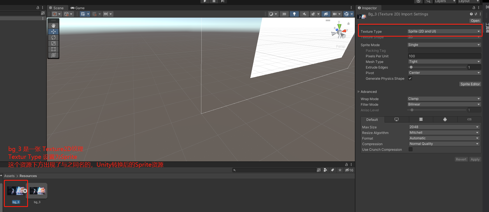

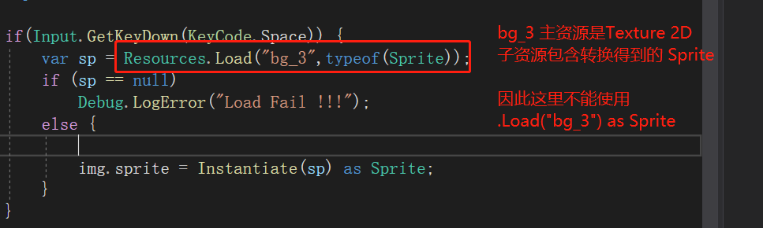

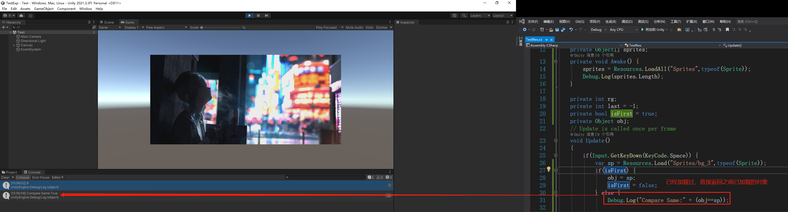

<br/>

### 5.1.2 Resources.LoadAll 同步加载

public static Object[] LoadAll (string path);
public static Object[] LoadAll (string path, typeof(Sprite/GameObject));

如果path末端是文件夹，加载其中的所有文件并返回，如果只是资源文件名，等同于 Load

如果是文件夹，尽量使用 typeof(Sprite) 约束，加载同一类型的资源，形成Array

再依次遍历 Instantiate 实例化，或是 Random 实例化

<br/>

### 5.1.3 Resources.LoadAsync 异步加载

public static ResourceRequest LoadAsync (string path);
public static ResourceRequest LoadAsync (string path, Type type);

异步加载可避免在主线程同步初次加载时间过长，导致掉帧

先发出加载命令，将应用延后到线程加载完成，主线程可继续运行

本质上是交由某个线程来进行加载

可结合协程对 ResourceRequest 进行 yield return，等待加载完成后返回协程

主线程也可通过 .complete() 方法，同步到加载完成（类似Jobs）

ResourceRequest，封装了加载请求相关

[Unity官方ResourceRequestAPI](https://docs.unity3d.com/cn/current/ScriptReference/ResourceRequest.html)

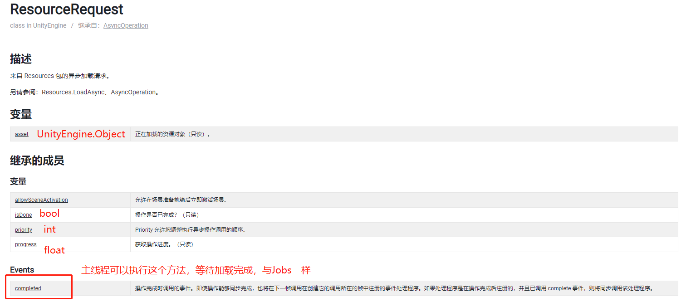

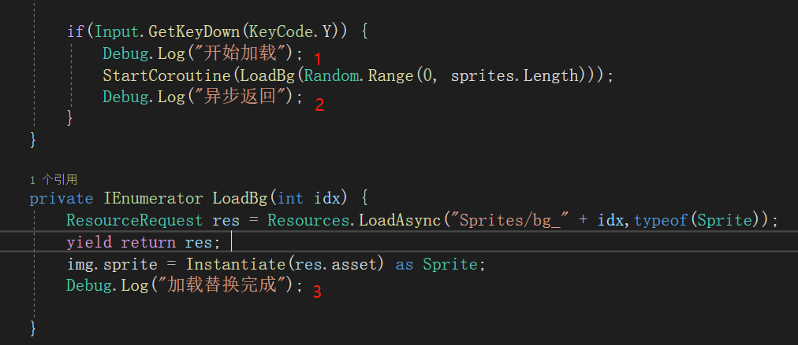

<br/>

### 5.1.4 Resources.UnloadAsset

#### 【这个API不止局限于 Resource的资源加载】

public static void UnloadAsset (Object assetToUnload);

只能卸载Asset对象，也就是 .Load 返回到的Object对象 （不是 Instantiate 实例化得到的对象）

【不安全】即使对象仍在使用/正在引用，依然可以强制卸载，卸载将导致对象无法被重加载

[无法卸载 Sprite / SpriteAltas?](https://answer.uwa4d.com/question/5fd4de5210a17c6c2b09d625)

<br/>

[UnloadAsset报错问题](https://blog.csdn.net/qq_37310110/article/details/103161300)

用UnloadAsset()去释放GameObject的时候会报错：

UnloadAsset may only be used on individual assets and can not be used on GameObject's/Components or AssetBundles。

也就是说不能释放除individual assets类型以外的资源类型，只能释放（mesh / texture / material / shader ）


<br/>

### 5.1.5 Resources.UnloadUnusedAssets

#### 【这个API不止局限于 Resource的资源加载】

public static AsyncOperation UnloadUnusedAssets();

【安全的】卸载未使用的对象，但遍历查找比较耗时，一般只在切换场景时调用

“如果在遍历整个游戏对象层级视图后未访问到某资源（包括脚本组件），则将其视为未使用的资源。该操作也检查静态变量。”

**释放不使用的 prefab/Sprite/individual assets ，应在Destory场景中所有由该prefab创建出的实例对象后，将所有直接引用Assert对象的引用置null后，调用 Resources.UnloadUnusedAssets**

可结合协程对 AsyncOperation 进行 yield return 

<br/>

---

## 6. AssetBundle

### 总览

[Unity AB包基础&实战系列](https://blog.csdn.net/u014361280/category_7283495.html)

[Warl-G AB包学习](https://warl.top/posts/Unity-AssetBundle/)

[tx云 AB包杂记](https://cloud.tencent.com/developer/article/1335535)

### 6.1 AB包初介绍

#### 基础理论相关参考

[AB包官方文档](https://docs.unity3d.com/cn/current/Manual/AssetBundlesIntro.html)

[AB学习(一)理论基础](https://zhuanlan.zhihu.com/p/90498882)

[资源管理系统-基础篇（一）](https://zhuanlan.zhihu.com/p/96709802)

[资源管理系统-基础篇（三）AssetBundle原理](https://zhuanlan.zhihu.com/p/97551363)


AB包是一种资源的集合（可包含模型/贴图/Prefab/音效/lua代码）或者说资源的文件夹，Unity可以在运行时动态的加载AB包，并从AB包内加载 Asset 资源/对象

AB包可以选 LZMA/LZ4 两种压缩格式，或是无压缩

AB包像是一种更小，更可控的 Resources 文件夹

使用 AB 包是上线游戏进行热更新的基础，玩家无需重下整个游戏安装包，而是仅下载替换对应的AB包资源

一个AB包包括 **包头** 和 **数据段** 两部分

 - **包头** 包含了这个AB的相关信息：标识符、压缩类型、内容清单(manifest)，其中内容清单(manifest)与Resources文件夹合并出的序列化查找表文件是一样的（大多数平台上表现为平衡搜索树），但仅跟随这个AB包一并加载，而不是像Resource归纳一切并在启动时加载

 - **数据段**  包括序列化生成的AB内资源的原生数据
   - 选择 LZMA 压缩是所有资源会一并压缩为字节数组
   - 选择 LZ4 压缩，每个资源是单独分开压缩的
   - 无压缩，则保留原生序列化字节流
 
压缩后AB包更小，下载&从内存中加载速度更快，但构建AB包对象时需要解压缩，速度更慢

**AB包针对不同的平台会有差异化处理**，在打包时需要传入平台参数


<br/>

### 6.2 AB包的打包与存放

#### 打包操作相关参考

[基于Editor拓展手动打包](https://blog.csdn.net/qq_45035709/article/details/113522534)

[AssetBundle的一些整理（一）](https://blog.csdn.net/wangjiangrong/article/details/79545180)

#### 通过Editor拓展编辑手动打包

选中资源文件，在Inspector底部设置 AssetBundleName 和 AssetBundleVariant
 - AssetBundleName 包名，用于主要区分不同的AB包
 - AssetBundleVariant 变体后缀，用于区分同种AB包的不同形式（对应不同的配置）
 - AB包名为： AssetBundleName.AssetBundleVariant

**AssetBundleName可以设置为以 / 间隔的树状文件结构**，从而在下方的选卡中能够看到树状展开的列表

**AB包在打包后也会被放入树状文件结构对应的文件夹下**


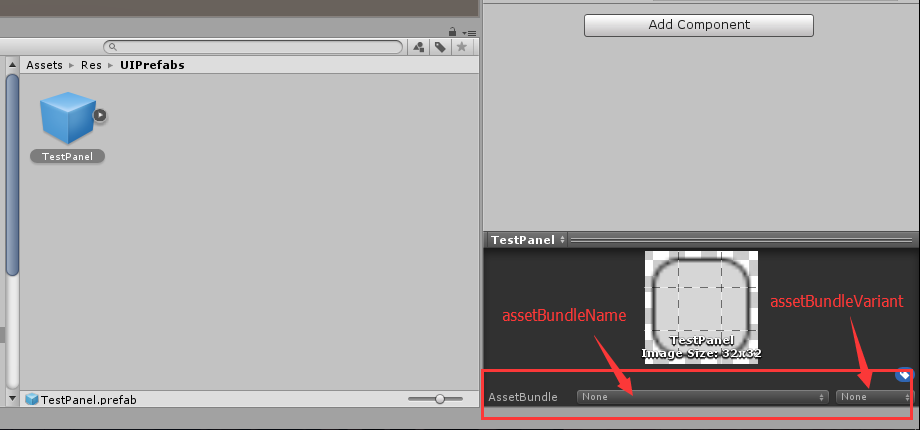

之后通过一个Editor脚本，使用静态方法：构建所有被设置了AB包名的资源为AB包

 BuildPipeline.BuildAssetBundles(path, BuildAssetBundleOptions, BuildTarget);

 - path 存放路径（注意不同平台下路径问题）
 - BuildAssetBundleOptions 打包设置（包括压缩模式的选择，[参见](https://docs.unity3d.com/cn/current/ScriptReference/BuildAssetBundleOptions.html)）
 - BuildTarget 目标平台（Win/Android/IOS）

#### 通过AssetBundleBrower打包

AssetBundleBrower是一个可视化的打包工具，引入后可从Window-AssetBundle Browser打开窗口

[Unity 使用AssetBundle-Browser](https://blog.csdn.net/WenHuiJun_/article/details/113178688)


### 6.2.2 AB包的打包存放

#### 资源路径相关参考：

[资源路径相关](https://warl.top/posts/Unity-Resource-Manage/)

[热更新设计目录相关](https://zhuanlan.zhihu.com/p/93178864)

[不同平台打包路径存放实例](https://blog.csdn.net/u014361280/article/details/108034891)

[不同平台下Application对应路径](https://blog.csdn.net/qq_34412086/article/details/84567224)


#### 上线游戏的服务器部署

当然对于上线游戏而言，打包获得AB包资源后，会部署到服务器上，并不跟随主安装包

对于不同的资源，生成url链接记录，并管理版本/热更相关

游戏启动时，通过url进行加载

[参考 - 使用NetBox2模拟ASP服务器加载AB包参考](https://blog.csdn.net/u014361280/article/details/78513349)

加载方法见下 6.3.1 接 线上加载


### 6.2.3 AB包的打包策略和加密

[打包策略相关参考](https://zhuanlan.zhihu.com/p/91926428)

[AB包的打包加密](https://blog.csdn.net/qq_28976599/article/details/124616287)

### 6.3 AssetBundle API

### 6.3.1 加载AB包

#### 本地加载

[参见3.2节](https://zhuanlan.zhihu.com/p/97551363)

```
using System.IO

AssetBundle.LoadFromMemory/Async(File.ReadAllBytes(filePath))  //(会生成两份内存不推荐)

AssetBundle.LoadFromStream/Async(File.ReadAllBytes(filePath)) //推荐)
```


需要传入File.ReadAllBytes 得到的 byte[]字节流，或者new FileStream 得到的IO流进行构建

也就是说得先行将AB包的数据加载到托管代码的字节数组里，之后构建AB包到本机内存块

通常只在对AB包进行了基于二进制文件的加密时使用，通过 File.ReadAllBytes(filePath) 作为参数，读取到内存，再构建AB包

<br/>

AssetBundle.LoadFromFile(path);

直接从路径中读取并构建AB包 

本地加载推荐使用，一种高效的API用于从本地磁盘中直接读取AB包并构建

但要注意不同平台下的路径问题

Editor环境下还是会整个加载到内存中，再构建，与LoadFromMemory一样，但发布实机不影响


<br/>

#### 实测 AB包 打包与发布与加载

win Android均使用StreamingAssetPath 存放可正常读写
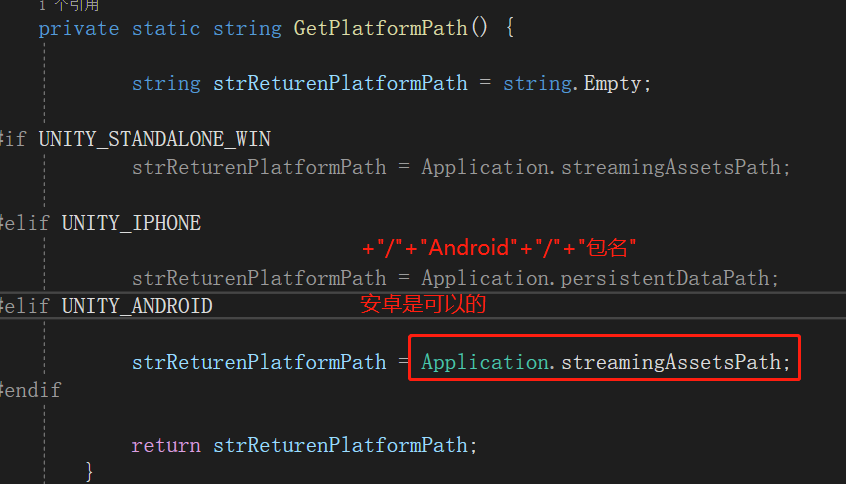

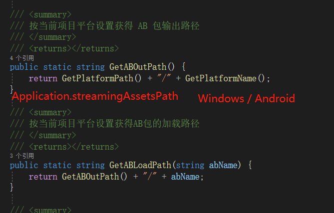

<br/>

Editor&win工程发布 加载ok 

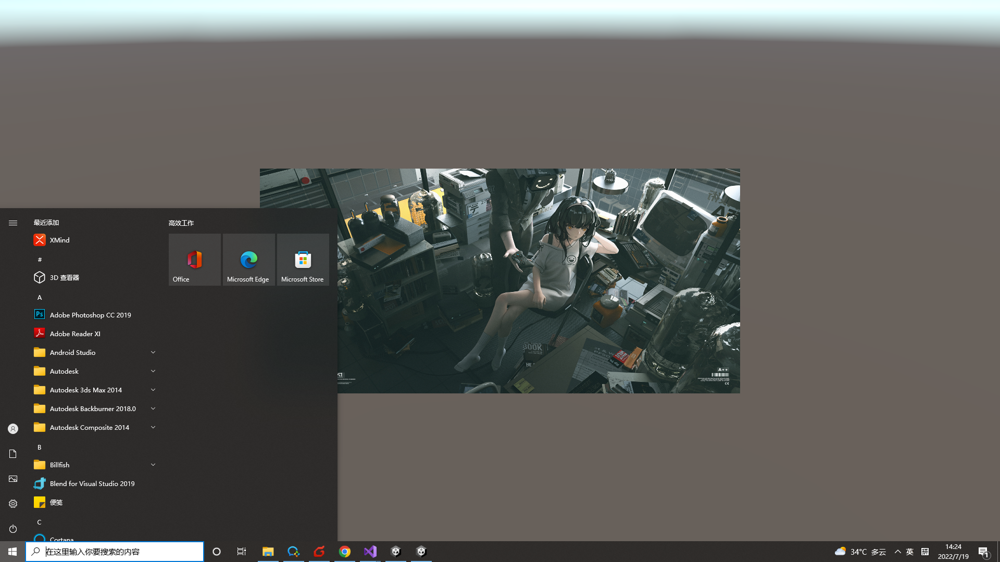

<br/>

Editor&Android 工程发布 加载ok 


<br/>

不过...

[据说还有一种 BetterStreamingAssets插件](https://download.csdn.net/download/weixin_42169245/18361447)

可以更好的在安卓下访问视频流文件

<br/>


#### 线上加载

一般的使用AB包的上线游戏开发，AB包资源可能存放于服务器上，不加入到安装包中，游戏启动时联网加载

此时需要使用 www/UnityWebRequest 加载，并填写服务器的 url ，

[参考 - 使用NetBox2模拟ASP服务器加载AB包参考](https://blog.csdn.net/u014361280/article/details/78513349)

<br/>


```
//【这个API或将弃用】

var www = WWW.LoadFromCacheOrDownload(url, 1);

//先查找本地缓存没有的话下载并写入到本地缓存中

yield return www;

var ab = www.assetBundle// 获取AB包

```

<br/>

```
UnityEngine.Networking

//【注意】 UnityWebRequest.GetAssetBundle 于2021版本已过时
                 
var request = UnityWebRequestAssetBundle.GetAssetBundle(url);

//先生成一个下载请求句柄

yield return request.SendWebRequest();

var ab = DownloadHandlerAssetBundle.GetContent(request);
```

要特别注意的是，WWW和UnityWebRequest的URL格式

对于服务器加载URL应当是

http:/127.x.xx/AssetBundles/package.unity 这样的域名+文件夹名的形式

<br/>

也可以应用于本地加载URL应当是

file://D:\Unity2017\Unity2017Project\AssetBundle1112


<br/>

如果是安卓针对StreamingAsset的本地加载，前面还要加上 jar:

jar:file://D:\Unity2017\Unity2017Project\AssetBundle1112

<br/>


#### 实测通过 UnityWebRequestAssetBundle 本地加载AB包

在AB包的输出主路径（StreamingAsset）

win之前加上了 file:// 前缀

Android之前加上了 jar:file:// 前缀

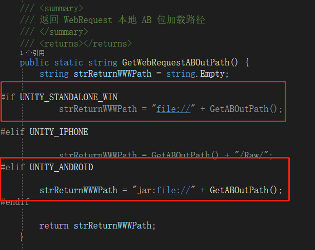

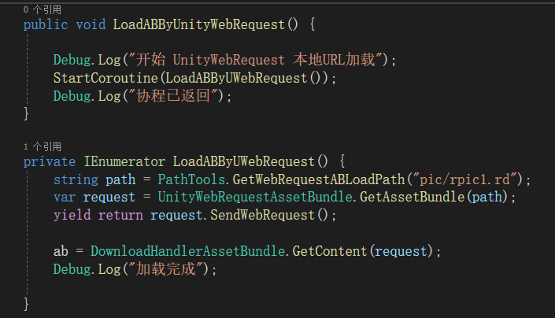

Editor运行有效
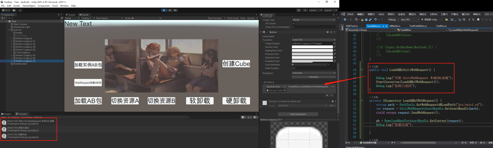

PC工程发布实测运行 ok

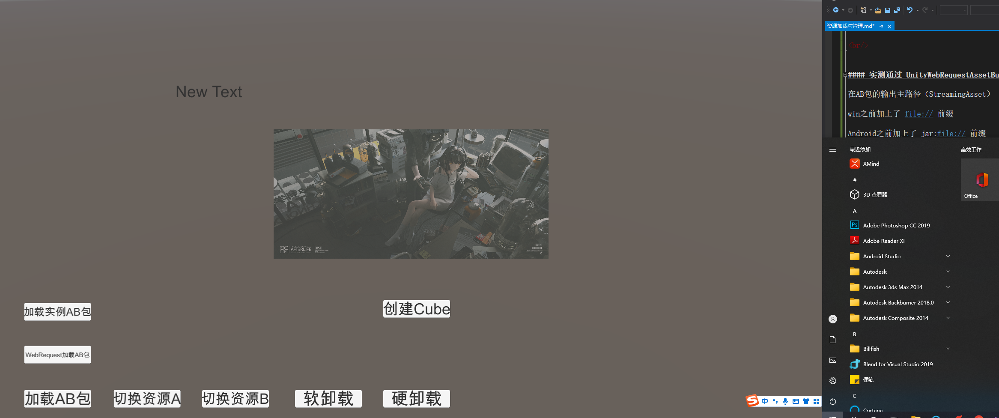

Androir工程发布实测运行ok

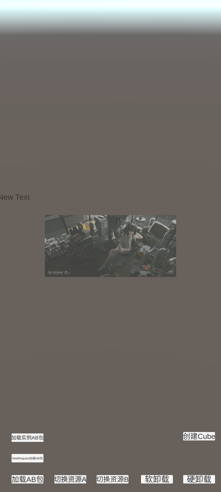


**此外要特别注意的是，安卓加了 jar:file:// 前缀，如果在Editor下测试是不通过的**

测试的时候可以宏定义，让Editor和Win使用同一个路径

UNITY_EDITOR || UNITY_STANDALONE_WIN

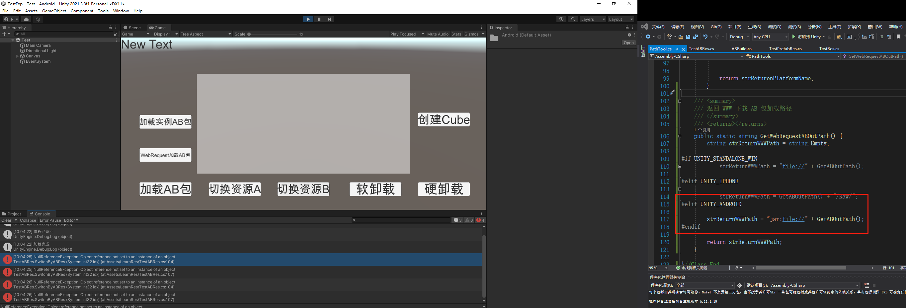

<br/>

### 6.3.2 AB包间依赖状况的加载

[官方AB包依赖](https://docs.unity3d.com/cn/current/Manual/AssetBundles-Dependencies.html)

[多处引用资源而未指定资源的AB包，导致多重拷贝](https://zhuanlan.zhihu.com/p/34137188)

[参见第5节](https://blog.csdn.net/Go_Accepted/article/details/123855187)

<br/>

#### 依赖的发生

如果1号包中的一个资源，引用了某个不在1号包内的资源（一个经典的例子是Prefab对Material的引用）

**并且这个被引用的资源，指定了自己的AB包为2号包**，此时就会发生依赖 1号包依赖于2号包

**注意！！如果这个被引用的资源没有指定自己的AB包，那么实际打包时1号包会将这个资源复制一份到自己内部**

**注意多重引用导致的多重拷贝，引起包体大小上升问题**

<br/>

#### 依赖状况下的加载

如果我们要使用1号包中的Asset

而1号包中的Asset引用来了来自2号包的Asset

那么我们需要在加载12号包之后，之后才能加载1号包的Asset对象

AB包间的依赖关系可以通过1号包头的Manifest获取

<br/>

#### 依赖加载实测

未加载依赖包，直接实例化Cube材质丢失
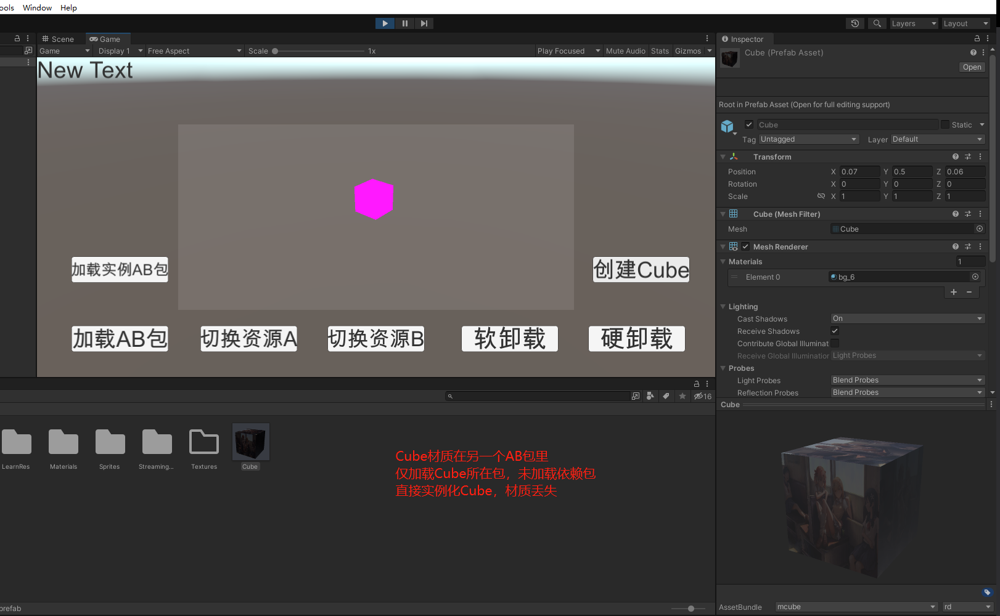

打开Cube所在的AB包 manifest 文件，可以看到下方的 Dependencies 依赖

显示依赖材质所在的 AB 包

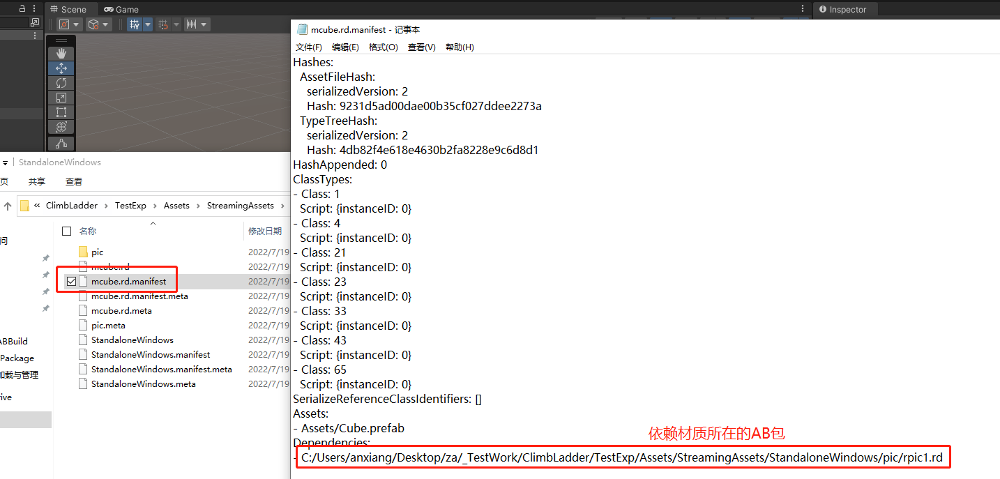

#### 要特别注意，网上一堆博客小天才相互复制，导致错误的manifest文件加载方法“广为流传”

#### 虽然我们打开AB包的manifest文件能看到这个AB包的依赖项，但真正的能够反映项目中所有AB包依赖的manifest，也在一个特殊的AB包中

#### 这个【特殊的manifestAB包】，是我们打包时，AB包主存放目录下，与这个目录文件夹同名的一个AB包

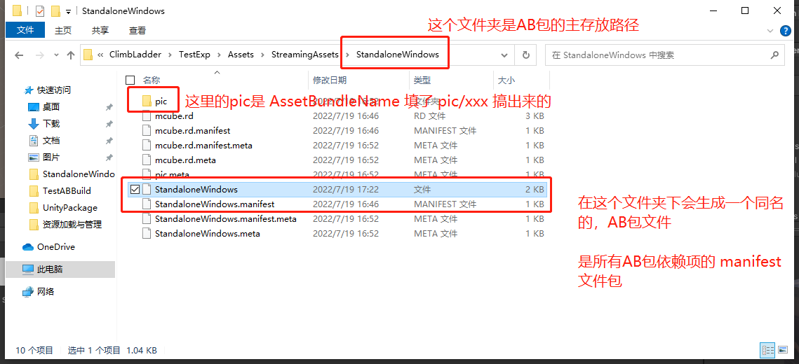

打开这个【特殊的manifestAB包】 可以看到与Cube所在AB包的 manifest 不同，这里记录了所有AB包的依赖关系
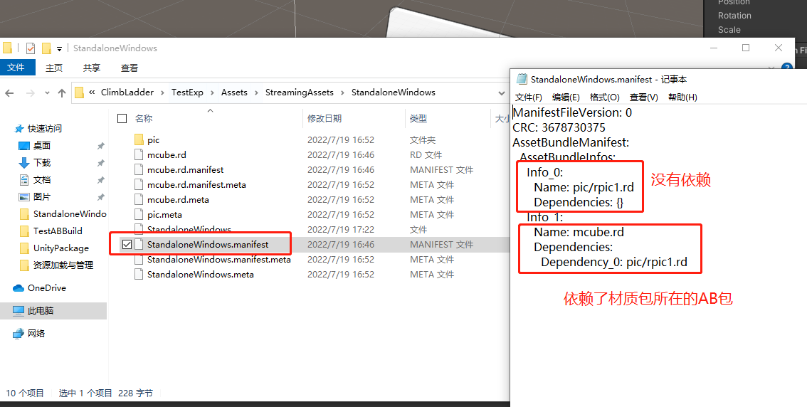

我们在PathTools中编码一个方法，来获取到这个特殊包的目录
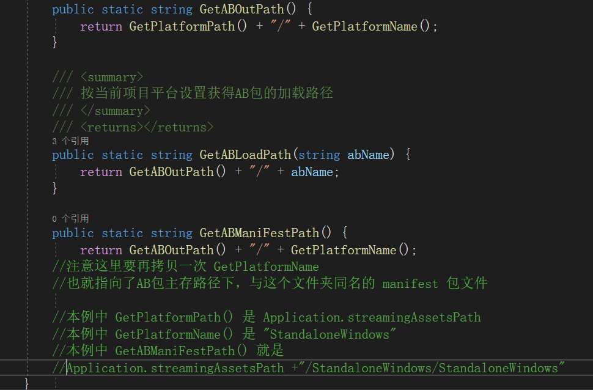

在加载Cube所在AB包之后，加载【特殊的manifestAB包】，从中获取Cube包的依赖包一并加载

**注意实际打包时应使用一定的策略，减少AB包间的依赖**

我们只能通过 manifestAB包 获取到某个AB包的依赖包一并加载，无法获取资源之间的依赖关系

**极端状况下，依赖包的加载可能需要递归执行**

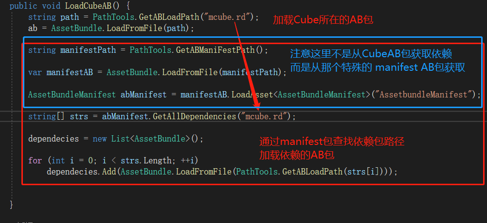

Editor运行，在加载了依赖包之后，加载 Prefab Asset 并实例化，可以看到Cube正常的创建了

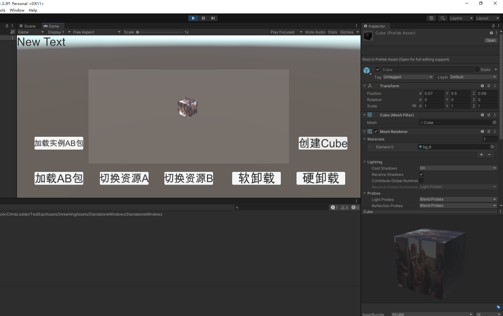

PC工程发布实测运行OK

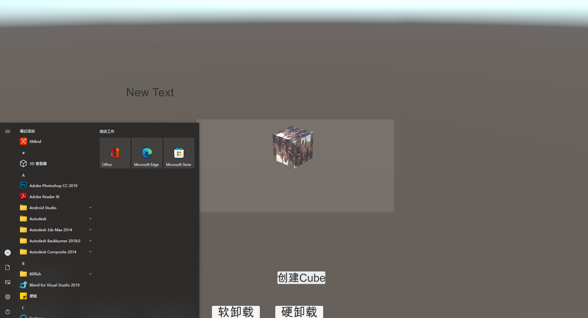

Android工程发布实测运行OK

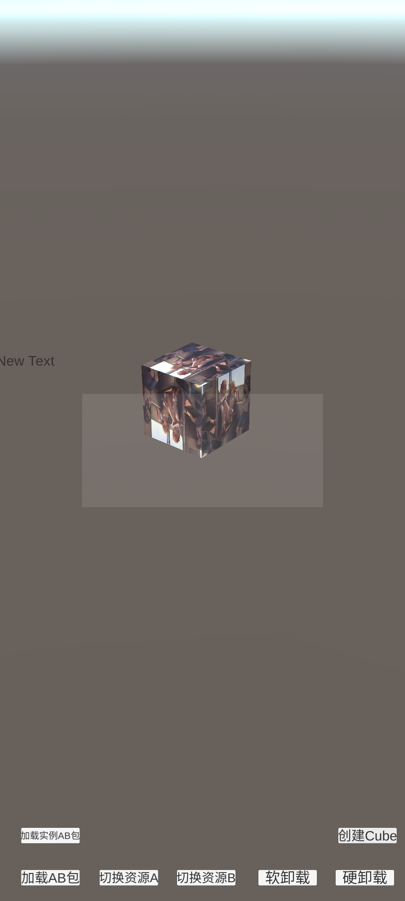

<br/>

### 6.3.3 加载Asset对象

[参考 - AssetBundle Asset 加载 6 种API](https://warl.top/posts/Unity-Resource-Manage/)

<br/>

三组六种API，每组都有同步/异步两种可选

LoadAsset/LoadAssetAsync

最常使用，加载指定名称的对象

<br/>

LoadAllAssets/LoadAllAssetsAsync

如果AB包中有大量独立的对象需要一并加载可使用

<br/>

LoadAssetWithSubAssets/LoadAssetWithSubAssetsAsync

加载对象包含许多内嵌对象，并且内嵌对象均来自此AB包中,一并加载对象和所有子对象

<br/>

### 6.3.4 卸载AB包和Asset对象

```
ab.Unload(false);
//软卸载 卸载AB包，以及从AB包中加载的，没有被引用的 Asset 对象

ab.Unload(true);
//硬卸载，卸载AB包，以及所以AB包中加载的Asset对象（即使正在使用/引用也可强制卸载）

//别忘了 Resources 两个API可以帮助卸载 Asset 对象
Resources.UnloadAsset(Obj);
//卸载Asset对象

Resources.UnloadUnusedAssets();
//遍历场景 卸载没有被引用的Asset对象
//开销大，通常只在切换场景时使用

```

<br/>

### 6.4 AssetBundleManager架构

一套对AB包加载卸载管理进行封装的架构

早期曾出现于 Unity Package Manager 中后被移除

但这套代码在一线依然很活跃

[参考 - AssetBundleManager官方Demo简析](https://blog.csdn.net/Game_Builder/article/details/100690071)

<br/>

---

### 7. Addressable Asset System

Unity 在2017新推出的一套资源管理系统

兼具 AssetBundleBrower 的可视化打包

以及类似 Resources / AssetBundle 的资源加载API

可快速从 Resource / AssetBundle 迁移到 Addressable

[Addressable Asset System 正式版应用（一）](https://zhuanlan.zhihu.com/p/77600079)

[The Addressable Asset System 正式版应用（二）](https://zhuanlan.zhihu.com/p/82247256)

<br/>

---

## 8. AssetDataBase

[AssetDateBase官方手册](https://docs.unity3d.com/cn/current/Manual/AssetDatabase.html)

[AssetDateBase脚本API](https://docs.unity3d.com/cn/current/ScriptReference/AssetDatabase.html)

Unity 资源数据库 (Asset Database)，这个API 仅限于 Editor 环境下使用

它最大的作用不是用来加载资源，而是**结合拓展编辑器对 Unity 资源的导入、创建、管理、批处理提供操作接口**

<br/>

### 8.1 用 AssetDateBase.LoadAssetAtPath 来加载资源（仅限Editor测试）

这个API和Resource.Load很像，默认返回 UnityEngine.Object ，可加 typeof(Sprite) 或者 \<Sprite\> 

**注意 AssetDateBase 仅限 Editor 使用，无法在发布工程中应用**

但好处是我们无需像Resource.Load那样在意资源的路径，AssetDateBase 能够通过根目录下相对路径访问到工程中的所有资源

**特别注意，AssetDateBase.LoadAssetAtPath 的路径是要带后缀的，与Resource.Load加载时不同**

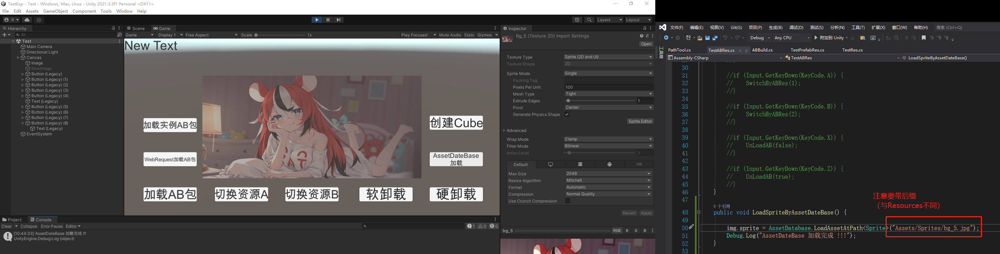

<br/>

### 8.2 结合拓展编辑用 AssetDatabase.CreateAsset 生成 Preset资源

我们先定义了一个ScriptableObject里面包含一些数据
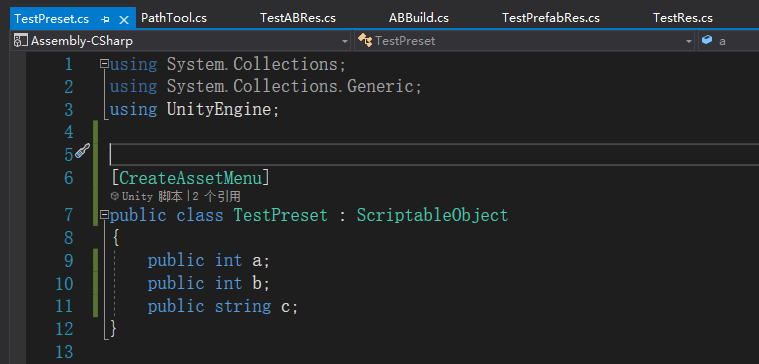

这些数据与某个类中的参数是对应的，作为一种预设

我们可以在运行时，创建一个 TestPreset 实例，将当前编辑的数据抄写下来

之后通过 AssetDatabase.CreateAsset 将这个实例创建为一个资源对象，将这份Preset数据保存下来

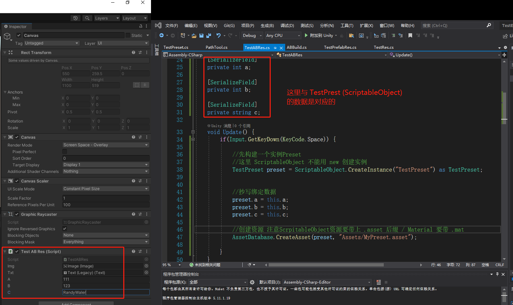

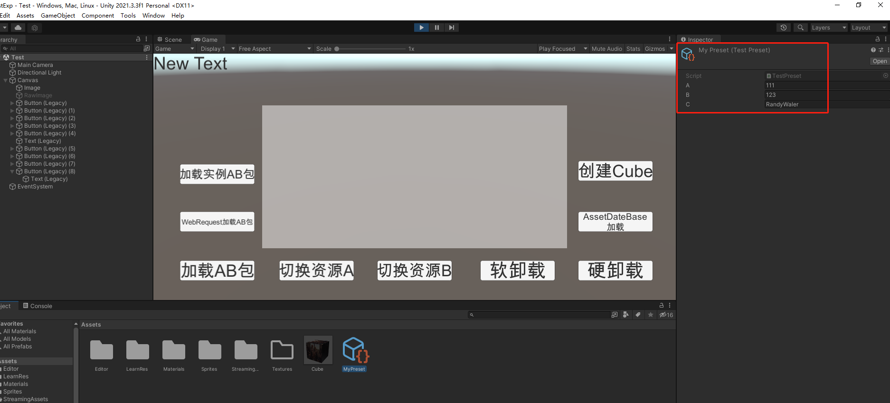


